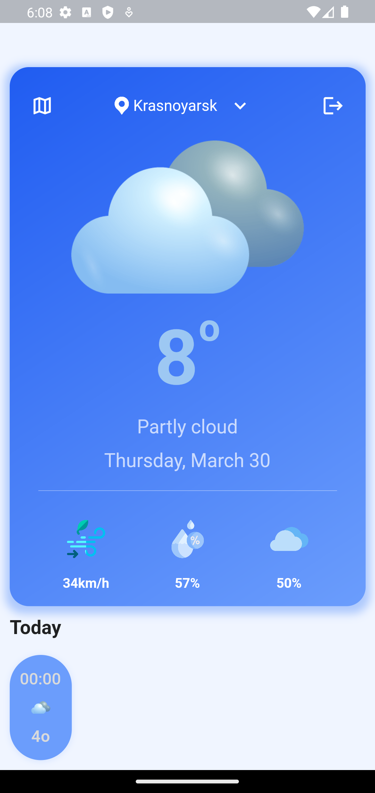
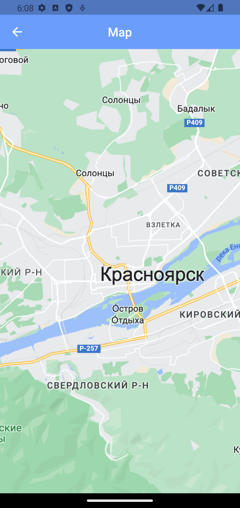
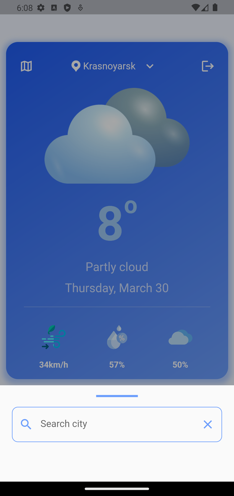

# weather

A weather Flutter project.

# Инструкция

Для запуска приложения необходимо иметь на утройстве:

- flutter
- Android emulator
- Android выше 11 версии

### Перед запуском приложения желательно запустить `flutter doctor`, чтобы проверить корректность работы flutter
### Все необходимые зависимости находятся в файле [pubspec.yaml](pubspec.yaml) они будут установлены при выполнении команды `flutter pub get`
Необходимо перейти в директорию проекта и выполнить следующие команды в терминале:

```zsh
flutter pub get
```

Запустить Android emulator

```zsh
flutter run
```
# apk

[apk-файл](apk/app-release.apk)

### Запуск приложения на Android emulator

Необходимо скачать apk-файл и запустить Android emulator

```zsh
adb install apk/app-release.apk
```

# Screenshots





